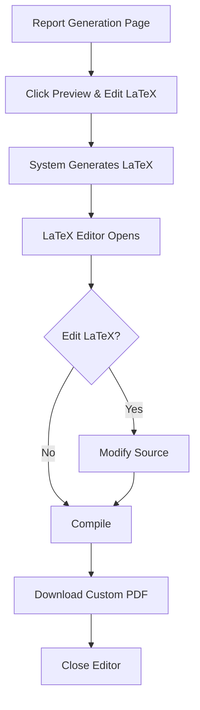

# LaTeX Report Preview & Editor

## Overview
The system now includes an **interactive LaTeX editor** that allows users to preview and customize report LaTeX source code before generating the final PDF. This gives power users full control over report formatting and content.

## Features

### 1. **LaTeX Preview**
- Click "📝 Preview & Edit LaTeX" button
- System generates LaTeX source code for the current case
- Opens in full-screen editor modal

### 2. **Interactive Editor**
- **Line Numbers**: Easy navigation
- **Syntax Highlighting**: Monospace font for readability
- **Real-time Editing**: Modify any part of the LaTeX
- **Dirty State Tracking**: Shows when changes are made
- **Keyboard Shortcuts**: `Ctrl+S` or `Cmd+S` to compile

### 3. **Custom Compilation**
- Edit LaTeX source directly in browser
- Click "🔨 Compile to PDF" to generate custom PDF
- Downloads compiled PDF immediately
- Error handling for compilation issues

### 4. **Editor Features**
| Feature | Description |
|---------|-------------|
| **Line Count** | Shows total lines in source |
| **Modified Indicator** | Yellow dot when edited |
| **Reset Button** | Restore original LaTeX |
| **Full Screen** | 95% viewport for editing |
| **Dark Theme** | Easy on eyes for long editing |

## User Workflow



## API Endpoints

### Preview LaTeX Source
```bash
POST /api/report/preview_latex/
{
  "case_id": 1
}

Response:
{
  "latex_source": "\\documentclass{report}...",
  "case_name": "Ransomware Investigation",
  "event_count": 245,
  "story_count": 3
}
```

### Compile Custom LaTeX
```bash
POST /api/report/compile_custom_latex/
{
  "latex_source": "\\documentclass{report}...",
  "filename": "custom_report.pdf"
}

Response: Binary PDF file
```

## Frontend Components

### LaTeXEditor Component
Location: `frontend/src/components/LaTeXEditor.tsx`

**Props:**
- `initialLatex`: Initial LaTeX source code
- `caseName`: Display name for the report
- `onCompile`: Callback when user compiles
- `onClose`: Callback to close editor
- `isCompiling`: Loading state during compilation

**Features:**
- Textarea with monospace font
- Line number gutter
- Keyboard shortcuts
- Dirty state tracking
- Reset functionality

### ReportGeneration Integration
Location: `frontend/src/pages/ReportGeneration.tsx`

**New State:**
```typescript
const [showLatexEditor, setShowLatexEditor] = useState(false);
const [latexSource, setLatexSource] = useState('');
const [loadingLatex, setLoadingLatex] = useState(false);
const [compilingLatex, setCompilingLatex] = useState(false);
```

**New Handlers:**
- `handlePreviewLatex()`: Load LaTeX source
- `handleCompileLatex()`: Compile custom LaTeX

## Backend Implementation

### LaTeX Generator Methods
Location: `backend/core/services/latex_report_generator.py`

**New Methods:**

#### `generate_latex_preview(case_data: Dict) -> str`
Generates LaTeX source code without compiling:
- Creates complete LaTeX document
- Includes all sections and data
- Returns raw LaTeX string

#### `compile_custom_latex(latex_content: str) -> tuple`
Compiles user-edited LaTeX:
- Takes custom LaTeX source
- Compiles with pdflatex
- Returns (pdf_bytes, error_message)

### ViewSet Actions
Location: `backend/core/views.py`

#### `@action preview_latex`
- Gathers case data
- Generates LaTeX source
- Returns JSON with source code

#### `@action compile_custom_latex`
- Receives custom LaTeX
- Compiles to PDF
- Returns binary PDF file

## Use Cases

### 1. Custom Branding
Users can add:
- Company logos
- Custom headers/footers
- Specific formatting

### 2. Content Adjustment
Users can:
- Add custom sections
- Modify existing tables
- Include additional commentary

### 3. Formatting Changes
Users can:
- Adjust margins and spacing
- Change fonts and colors
- Customize table layouts

### 4. Multi-language Reports
Users can:
- Translate section headers
- Add language packages
- Change document language

## Editor UI

```
┌─────────────────────────────────────────────────────┐
│ 📝 LaTeX Report Editor                          ✕   │
│ Ransomware Investigation • 342 lines • Modified     │
├─────────────────────────────────────────────────────┤
│ 🔨 Compile to PDF    ↺ Reset    Ctrl+S = Compile   │
├────┬────────────────────────────────────────────────┤
│  1 │ \documentclass{report}                         │
│  2 │ \usepackage{geometry}                          │
│  3 │ \begin{document}                               │
│  4 │ \section{Investigation Overview}               │
│ .. │ ...                                            │
│342 │ \end{document}                                 │
├────┴────────────────────────────────────────────────┤
│ 💡 Tip: Edit sections, tables, or formatting       │
│                                        ● Modified   │
└─────────────────────────────────────────────────────┘
```

## Security Considerations

### LaTeX Injection Prevention
- User input is already escaped in LaTeX generation
- Custom LaTeX runs in isolated environment
- Timeout protection (30 seconds)
- No shell access from LaTeX

### File Access
- Compilation in temporary directory
- No file system access beyond temp dir
- Automatic cleanup after compilation

## Performance

### Editor Loading
- **Preview Generation**: ~1-2 seconds
- **Editor Open**: Instant (client-side)
- **LaTeX Size**: Typically 10-50 KB

### Compilation Times
- **Standard Report**: ~8-12 seconds
- **Custom Report**: ~8-15 seconds (varies by complexity)
- **Timeout**: 30 seconds maximum

## Troubleshooting

### LaTeX Won't Compile

**Issue**: Custom LaTeX fails to compile

**Solutions:**
1. Check LaTeX syntax errors
2. Verify all `\begin{}` have matching `\end{}`
3. Ensure required packages are used
4. Check for special characters needing escaping

### Editor Won't Open

**Issue**: Preview button doesn't work

**Solutions:**
1. Check browser console for errors
2. Verify case has events/data
3. Check network tab for API errors
4. Reload page and try again

### PDF Download Fails

**Issue**: Compilation succeeds but no download

**Solutions:**
1. Check browser download settings
2. Verify popup blockers aren't interfering
3. Try different browser
4. Check available disk space

## Keyboard Shortcuts

| Shortcut | Action |
|----------|--------|
| `Ctrl+S` / `Cmd+S` | Compile to PDF |
| `Esc` | Close editor (confirmation if modified) |
| `Ctrl+Z` | Undo (standard textarea) |
| `Tab` | Insert 2 spaces |

## Future Enhancements

- [ ] Syntax highlighting for LaTeX
- [ ] Auto-completion for LaTeX commands
- [ ] Live preview (split screen with PDF)
- [ ] LaTeX templates library
- [ ] Collaborative editing
- [ ] Version history for custom reports
- [ ] Export/import LaTeX templates
- [ ] Macro/snippet support

## Example Customizations

### Add Custom Logo
```latex
\begin{titlepage}
\centering
\includegraphics[width=3cm]{company_logo.png}  % Add this
\vspace*{2cm}
{\Huge \textbf{FORENSIC LOG ANALYSIS REPORT}}
...
\end{titlepage}
```

### Custom Color Scheme
```latex
\usepackage{xcolor}
\definecolor{companyblue}{RGB}{0,102,204}
\renewcommand{\section}[1]{\textcolor{companyblue}{\Large\textbf{#1}}}
```

### Additional Section
```latex
\newpage
\section{Legal Disclaimer}
This report is confidential and intended for...
```

## Related Documentation
- [NESTED_LATEX_REPORT_GUIDE.md](NESTED_LATEX_REPORT_GUIDE.md) - LaTeX report structure
- [API_REFERENCE.md](API_REFERENCE.md) - API documentation
- LaTeX Wikibook: https://en.wikibooks.org/wiki/LaTeX
